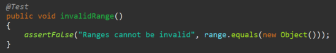

**SENG 438 - Software Testing, Reliability, and Quality**

**Lab. Report \#4 – Mutation Testing and Web app testing**

| Group \#:         | 24  |
| --------------    | --- |
| Student Names:    |     |
| Alend Maci        |     |
| Caleb Bourbonnais |     |
| Alex Whelan       |     |
| Agustin Belarde   |     |

# Introduction
This document outlines the mutation coverage improvements for JFreeChart’s Range and DataUtilities classes from group 25’s assignment 3 submission. Included are the analysis of 10 mutants produced by Pitest, and an overview of the mutation score improvements for Range and Datautilities classes. Also included is a Selenium testing suite, which provides UI testing for the essential functions of the Gap Canada Site. Utilizing the knowledge obtained from the class, we created a UI testing suite using Selenium, and successfully identified and created test cases against each of the mutants to improve mutation coverage for the JFreeChart Jar file.


# Analysis of 10 Mutants of the Range class 
<b>1. getLowerBound()</b>
```
replaced double return with 0.0d for org/jfree/data/Range::getLowerBound → KILLED
```
    	Test Coverage:
    	The mutant was killed by our original testing suite. This is because we have test cases where we test the output of the getLowerBound method against an expected value.


<b>2. contains()</b>
```
Substituted 1 with 0 → SURVIVED
```
	Test Coverage:
	The mutant survived our original testing suite. This is because there was a lack of coverage for this method, which resulted in the test not asserting the output against an expected value.


<b>3. getLength()</b>
```
Replaced double subtraction with addition → KILLED
```

	Test Coverage:
	The mutant was killed by our original testing suite since we asserted the returned value of this method against an expected value.


<b>4. scale()</b>
```
removed conditional - replaced comparison check with false → SURVIVED
```

	Test Coverage:
	The mutant survived the original testing suite. This is because we did not include a test that compares the output of the scaled range to its original value. We checked for an illegal argument exception, but in the case that the condition was ignored, there was no way to verify that scaling by a negative number would cause problems in the program.

<b>5. isNaNRange()</b>
```
removed conditional - replaced equality check with true → SURVIVED
```

	Test Coverage:
	The mutant survived the original test suite because there was a lack of robustness in our original testing class. Test cases that were previously designed assert the boolean output of the method, but there was a lack of input diversity.


<b>6. getUpperBound()</b>
```
Negated double field upper → KILLED
```

	Test Coverage:
	The mutant was killed by the original test suite since we compared the return value of the upper bound against an expected value. In the case that the method under test returned an incorrect value, the test would fail.


<b>7. expandToInclude()</b>
```
removed conditional - replaced equality check with false → SURVIVED
```

	Test Coverage:
	The mutant survived the original test suite due to a lack of coverage from the expandToInclude method. The lack of coverage resulted in the tests not asserting the output of the method against any expected value.


<b>8. equals()</b>
```
replaced boolean return with true for org/jfree/data/Range::equals → KILLED
```

	TestCoverage:
	The mutant was killed by the original test suite because we assert the output against the expected value in the case where an invalid Range object is passed as an argument.




<b>9. shift()</b>
```
replaced call to org/jfree/data/Range::shift with argument → KILLED
```

	Test Coverage:
	The mutant is killed by the original test suite since it contains a test case that checks for illegalArgumentExceptions when passing a null value.


<b>10. intersects()</b>
``` 
replaced boolean return with false for org/jfree/data/Range::intersects → SURVIVED
```
	
	Test Coverage:
	The mutant is killed by the original test suite since we assert that the output of the intersects method matched the expected value for a number of different Range objects.


# Report all the statistics and the mutation score for each test class
## Class Range: 

Previous assignments test suite:


New test suite:


## Class DataUtilities: 

Previous assignments test suite:


New test suite:


# Analysis drawn on the effectiveness of each of the test classes
Between the two classes under test, Range and DataUtilities, developing tests was a lot easier for DataUtilities as opposed to Range. This was primarily due to the smaller amount of code in DataUtilities which allows more comprehensive test coverage with less code. 

Range Methods:


DataUtilities Methods:


Aside from the difficulty of having more methods to test in the Range class, there were challenges encountered while attempting to improve the mutation coverage for the DataUtilities class. Our previous test suite had already achieved a high mutation coverage score, which made further improvements difficult to implement, resulting in an improvement slightly less than our target of 10%. This was mostly due to the presence of equivalent mutants and the inability to target them within our test classes.


# A discussion on the effect of equivalent mutants on mutation score accuracy
Due to mutations being alterations to the code that is under test, quantitatively reported by the ratio of mutations killed divided by total mutations injected, equivalent mutations can skew the reporting score accuracy. This is because equivalent mutations are mutations that change the code, however, their end behaviour is still the same as the original code. As a result, these mutations are categorized as surviving due to not correctly altering the software's observable behaviour. This then increases the total mutations conducted but does not allow more kills to also be made, resulting in an overall decrease in score and thus in accuracy.

One way to automatically detect equivalent mutants could be to use some kind of system where several unit tests using varying data are run on a unit of code prior to being mutated, and then performing the same exact tests on a mutated version of the code and comparing the outcomes. If the outcomes are the exact same regardless of which version of the code is used and regardless of the data value used, we can detect equivalent mutants, as the mutants are not changing or affecting the output. If the results do differ we know that the mutants are not equivalent as they affect the output of the tests and therefore must be detected using another strategy.

# A discussion of what could have been done to improve the mutation score of the test suites
In groups, we conducted analysis of the mutants created by the Pitest for the specific classes under test: Range and DataUtilities. Surviving mutations were then targeted by either adding test cases to the existing testing class, or improving the pre-existing test cases to allow for better coverage. In the case of the DataUtilities calculateColumnTotal and calculateRowTotal methods, there was already a high mutation coverage, so test cases were mostly improved rather than creating new ones to improve the coverage. This coverage improvement was accomplished by changing the mocking classes to allow for a better variety of test data. All test modifications were completed using pair programming techniques to help avoid problems with our tests.


A difficulty encountered in our testing suite was the inconsistency of testing strategies throughout each of the testing classes, largely due to work being divided among group members for our previous assignment. These inconsistencies led to mutations of the same type being killed by only about half of the test cases. This resulted in us implementing test case improvements in many of the testing classes rather than the addition of test cases. Some of the inconsistencies among classes included input diversity, as well as the effectiveness of assertions.

To improve mutation scores in the future, more collaboration is required to ensure that input diversity and assertion effectiveness is consistent throughout the test suite. It was difficult to identify other methods in which we could improve the mutation score, as we already achieved a high level of coverage from our previous test suite.

# Why do we need mutation testing? Advantages and disadvantages of mutation testing
Mutation testing allows developers to evaluate how effective their test cases are. This is done by making small changes (mutations) to the source code and checking if the written tests are able to detect them (killed) or if the tests don't (survived). 

There are many advantages of using mutation testing, including the following:
- Helps developers find weak test cases by checking where a lot of mutations are surviving
- Helps developers improve the quality of their tests as mutation coverage means more than just line or statement coverage. It helps check if the tests can find actual faults
- Ensures reliability in tests. If you have good mutation coverage on tests, you can rely on those tests to catch more real world bugs

Although there many advantages, there are also many disadvantages of mutation testing such as:
- Generating and running all the mutations is computationally expensive on hardware
- Some mutants that are generated may not change the source codes behaviour that much
- Developers already need to have a strong initial test suite in order to perform mutations

# Explain your SELENUIM test case design process
## Alend 
The function that I tested for the GAP Canada website was the Language changing function from English to French and French to English. Additionally, I also conducted tests for the “find locations” functionality of the website. The process that was implemented for designing these test cases was utilizing ad-hoc testing through exploring the webpage. Once I found some functionality that seemed to work from this approach, I developed a ridged Selenium scripted test to observe assertable results. All tests developed observed unique and different inputs handling valid/invalid or boolean operations allowed with these respective functions. 

## Agustin
The two functions I tested for the GAP Canada website were the “Login” and the “Add/Remove from cart”. The first thing I needed to do was understand how the Selenium IDE worked and where to install it. Once I became well-versed in Selenium, I went to the GAP website to see how the Login and Cart functionality actually worked. Once I knew how they worked, I looked for text or other elements that were present in order to find an assertion for my tests. Then I was finally able to design my different test cases, ensuring that I was using different forms of data such as valid and invalid credentials for the login. Initially I was only testing adding to the cart, but to test different forms of data, I decided to test the remove from cart function.

## Alex
The two functions I tested for the GAP Canada webpage were the filter by department functionality and redirect to social media page functionality. First, I explored the web page and determined different functionality that could be tested. Then, I coordinated with my other group members to ensure we didn't duplicate tests and then chose my test cases. I then developed Selenium tests by testing the two functions and asserting expected text and web page titles when either using the filtering functionality or the social media page redirection functionality. In both cases I tested different inputs to observe varying results and to ensure expected functionality. Specifically, for the filtering options, I filtered by several departments, notably the men, women and gender neutral options. For the social media links, I verified the YouTube link to redirect to the Gap Canada YouTube page and I also tested the redirect link to the Gap Canada TikTok site.

## Caleb
The two test cases I created for GAP Canada’s webpage were searching for items and signing up for the newsletter. To start, I had to get familiar with the Selenium IDE. After some difficulty, I learned that the IDE was not supported by Chrome and switched to another browser, and everything was straight forward from there. To test the search feature, I found the location of the search bar to input valid and invalid fields for the test cases. In each case, I asserted that the header on the search results page contained either the search results for the valid input, or a message that there were no search results found in the case of an invalid input. To implement the tests for registering to the newsletter, I navigated to the newsletter sign up form, where I created test cases for invalid/valid emails and postal codes. In each case, I created assertions based on the output messages when the form was submitted to test the functionality of the form.

# Explain the use of assertions and checkpoints
## Alend
Language Change Function:

For the verification of a test passing or failing for language changing, I had selected a specific phrase of text present on booth language instances of the website. The example of this was the phrase “Customer Service/Service à la Clientèle” which were both highlightable and a phrase that is statically rendered on successful language change for the website. Through this, I was able to apply a text based assert to verify the presence of the text element on the webpage, thus passing the test method or not. 

Find Location Function:

For the verification of Find Location function in the Gap Webpage, I had decided to use a split of valid and invalid inputs to script. Due to searching locations being a text-based input, the first test would take in the city name of “calgary” and thus implements a text based assertion to verify a passing score. For the invalidation testing approach, the input of “lalaland” was used for a non-existent city. As a result, the expectation is that an error message of no city found where a verification is conducted using the text-based assertion to confirm an error message on the webpage. 

## Agustin 
Login: 

As stated in the previous section, before I wrote my tests, I was looking for how the Login function worked and if there were any elements present that only occur when a successful login happens. This led me to discover that when a user successfully logs in, the website displays a message saying “Hello, input_Name”. This led me to choose that Hello message as my assertion as it would only appear after a successful login. For invalid credentials, the website would give me a message saying “No password correlated with account email”. Since it only occurs with invalid credentials, I chose that as my assertion. 

Add/Remove from cart: 

Like the Login, I was first looking to see how adding and removing from the cart worked. My approach for adding to cart involved choosing an item with a specific name. I would add that item to my cart, then navigate to the view cart page and check if that specific name was present. This allowed me to successfully choose that item as my assertion. For removing from the cart, I discovered that when the cart was empty, the website would give a message saying “Your cart was empty”. That allowed me to successfully choose that message as my assertion since it doesn't appear if the cart is not empty. So I would add one item then remove it, then assert that the empty cart message appeared.

## Alex
Filter by Department: 

To verify the varying department filtering options on the Gap Canada webpage, I used assertions to assert that the correct filtering tags appeared when a selected department was chosen. On the Gap Canada page, whenever a filtering option is applied a small tag appears to represent that a specified filter is applied. Since these tags appeared when a filter was applied and were highlightable, I simply used those tags to assert correct functionality by asserting that their specified text appeared once one of my filtering options was chosen. Specifically, when for example the “Gender Neutral” filter is applied, a small tag with the text “Gender Neutral” would appear and I would highlight the specific text of the tag and assert that text to ensure it correctly appeared.

Redirect to Social Media Links: 

To ensure correct redirection to varying social media pages, I also used simple assertions to ensure that the webpage titles in this case were correct. I would first complete all the basic site operations by scrolling to the links, pressing the links and then lately asserting that the title of the webpage matched the expected value. For example, I expected that when the YouTube link was pressed, the webpage title would be “Gap - YouTube”, so I asserted the title to be exactly that using the built in Assert Title function when right clicking, while recording a Selenium IDE test.

## Caleb
Search for Items: 

Before writing my tests, I checked the format of the page displayed upon making a search for a particular inventory item. In all cases, the header of the page was a message that it was showing results for the item searched, or that no results were found. I chose to use this header to assert that the entered string displayed a results page that matched. In the case of my valid search input, the results page would include a title that showed results for “sweater”, and in the case of the invalid search input, the title indicated that there were no search results found for “;”. It was simple to assert that the text in the header matched what was expected, which verified that the search bar and the results displayed were in sync with each other.

Subscribe to Newsletter: 

After analysis of the newsletter subscription form, I was able to identify the output message displayed when a valid email and postal code were entered, as well as when invalid inputs were entered. In the case where the email and postal code fields contain valid entries, a success message appeared, and in the case of invalid contents, a message was displayed underneath the incorrect input fields prompting the user to input correct details. I asserted that the text matched what was expected when there was a success, as well as an incorrect email field. This verified that the subscription form behaved as expected.

# how did you test each functionaity with different test data
## Alend 
Language Changing: 

The way this functionality was tested was by testing both states of the webpage as this function is only a bistate instance. The website can only be in English or French thus by testing both states with asserts, the whole functionality is tested. 

Finding Location: 

The way this function was tested was by verifying the functionality with a legitimate valid input, such as an existing city and then attempting an invalid input to test its error handling through a non-existent city being inputted. With these two test data inputs, the functionality of the feature was covered.
 
## Agustin
Login: 

To test the login function as a whole with different data, I decided to focus on the two outcomes for a user logging in. The first outcome being a successful and the second outcome being unsuccessful. My first test was with a valid email and valid password for an existing GAP Canada account that was set up beforehand. For the unsuccessful login, initially I was going to choose an invalid email and invalid password, but I discovered that the invalid email I chose belonged to an existing account so I decided to just input an invalid password, which resulted in the same error message to assert. By testing both outcomes, I was able to ensure that different data inputs were used.

Cart: 

Initially I was only going to test the adding cart functionality, but I shortly realized that in order to test with different data, I needed to test the cart functionality as a whole. The first test was done by adding an item to a cart and asserting that it was present. The second test was done by adding a single item to the cart and removing it, then asserting that the empty cart message was present. By testing both adding and removing from the cart, I was able to ensure that different data and inputs were used.

## Alex
Filtering by Departement: 

To test with different test data for the department filtering option, I simply just used all the filtering options under the Department section. Since only one could be selected at a time I was able to test both when a filter was applied as well as when it wasn't applied. Specifically, for the filtering option, there were three options, Men, Women and Gender Neutral, each of which only one could be selected. Thus, I selected each one by one and ensured the correct filtering option was applied by asserting the correct filtering tag text appeared, as mentioned before.

Redirect to Social Media Links: 

To test different test data for the social media links, I also just tested the varying social media options present on the Gap Canada page. Specifically, I tested the YouTube and TikTok pages, asserting that each of the windows titles were correct once the links were pressed. This ensured that I was able to test several different social media links and ensure consistent functionality.

## Caleb
Search for Items: 

Since we wanted to test both expected and unexpected user inputs for the search bar functionality, I chose to use “sweater” and “;” as the respective input fields. I chose “sweater” as the valid entry because the GAP Canada has a large inventory of the item, so it is expected that search results would be displayed. In the case of the invalid input, I chose to use a semicolon in the search field because it is not text. Because of this, we might expect there to be a different behaviour than that of a regular text input, which we found to be the case. Both input values garnered different responses from the application, which is what was desired to test the robustness of the search feature.

Subscribe to Newsletter: 

The newsletter subscription form inputs were chosen much like the search bar input, which was a mix of expected and unexpected values from the user. In this case, however, we needed to ensure that the email and postal code entered for testing the desired output were valid. I chose to use a personal email and postal code, which ensured that the testing of the functionality of the form included actual data, removing any ambiguity associated with the functions inputs. When testing the functionality of an invalid email entered, it was very easy to choose an email that is invalid, as it was a string that did not contain “@” or a domain. These choices of test data ensured that there was no ambiguity in the tests, which allowed us to verify the functionality of the subscription form to the best of our ability.

# Discuss advantages and disadvantages of Selenium vs. Sikulix
Selenium advantages
- More widely used, thus more documentation and tutorials are present
- Easy to integrate into browsers such as Chrome and FireFox

Selenium disadvantages
- Only works on webpages
- Certain test cases on a responsive webpage will usually fail as the Selenium will look for an ID of a pop-up or redirect that doesn't exist yet

Sikulix advantages
- Works on any GUI running on any OS, instead of being limited to webpages
- Is able to interact and recognize images, popups and more on screen unlike Selenium

Sikulix disadvantages
- Not as widely used compared to Selenium, so less documentation, forums or tutorials will be present
- Since image recognition is used, it will be computationally heavier compared to Selenium

# How the team work/effort was divided and managed
For part one of the assignment, work was distributed among the team members into two teams. One team prioritized the development of test cases for DataUtilities mutations, while the other team only focused on the Range mutations. The distribution of team members reflected the quantity of tests required by each class thus, more members focused on DataUtilities than range. For the second part, we did the selenium tests independently with peer to peer review after completion. 

The write-up for this assignment was done both collaboratively and individually. Some sections were worked on together as a group, while other sections were divided and/or assigned to a group member. At the end, a last proof-reading was done all together. 


# Difficulties encountered, challenges overcome, and lessons learned
A major difficulty encountered was the improvement of mutation coverage for classes that already had a high mutation score. In the case of the DataUtilities testing class from our previous assignment, there was little room for improvement that did not involve equivalence mutants. This made it very difficult to meet our target of 10% mutation coverage increase. After a conversation with the TA, it was determined that since we had already achieved a high level of mutation coverage, the improvement of 6% was sufficient for the DataUtilities class.

Another difficulty encountered was the inconsistency of our test designs between testing classes in our previous assignments. This included varying levels of assertion effectiveness and input diversity, which made it so that mutants of the same type were killed by some of our test classes and survived others. What we learned was that proper communication of our groups desired testing standards for our test suite would be required. This would ensure that mutation coverage remains consistent throughout all test classes, avoiding the hassle of refactoring certain test classes to maximize mutation coverage.

A significant difficulty encountered was that generating and running mutations took a really long time. This resulted in slower development times as we had to regenerate and re-run after every change. By the time we learned that we could configure the Pitest to run against a specific target class, we had already refactored the majority of the tests.

# Comments/feedback on the lab itself
The lab provided us with a solid understanding of Pitest and how to track mutation coverage for a test suite. Even though there were challenges associated with maximizing mutation scores, we were still able to improve our Range testing class to 80% and the DataUtilities class to 94%. We also learned and experimented with the Selenium IDE, which gave us a good understanding of how UI testing can be accomplished. 

All groups should have been provided the same test suite rather than working with the suite from assignment 3. Those who did a good job on assignment 3 were punished as the mutation score already started high thus improvements were more difficult to implement.